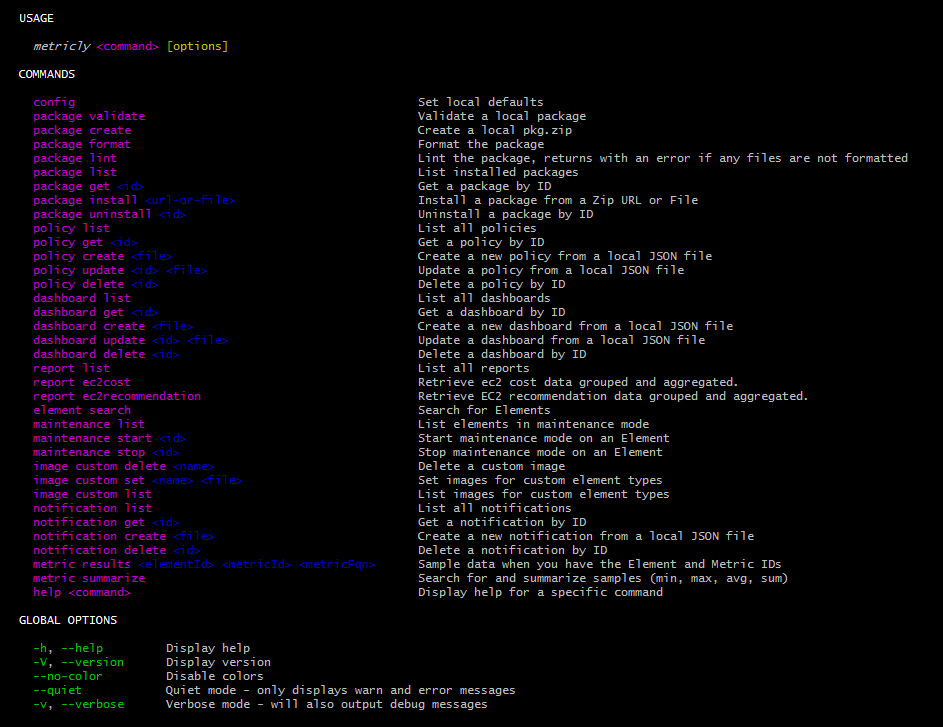

# Metricly CLI
Metricly command line interface to the [Metricly API](https://api.app.metricly.com/swagger-ui.html).  
This project originated from the awesome work done on [netuitive-package-validator](https://github.com/Netuitive/netuitive-package-validator)

Table of Contents
- [Installation](#installation)
    - [OS Specific](#os-specific)
    - [NPM](#npm)
- [Profiles](#profiles)
- [Formats](#formats)
- [Help](#help)
- [Development ](#development)
- [Testing](#testing)

## Installation 
`metricly` is available as an OS specific binary or simple NPM installation. 

### OS Specific
Attached to the [latest GitHub release](https://github.com/metricly/metricly-cli/releases/latest) there are binaries for each
- [Windows](https://github.com/metricly/metricly-cli/releases/latest)
- [Linux](https://github.com/metricly/metricly-cli/releases/latest)
- [Mac](https://github.com/metricly/metricly-cli/releases/latest)

Download the binary for your system, add it to your path, make it executable, and run `metricly -h`.

### NPM
```
npm i -g metricly-cli
metricly -h
```

## Profiles
`metricly` supports the concept of profiles.  You can run certain commands with `--profile` 

`metricly` creates a _default_ profile when you run `metricly config` 

### Creating a new profile
`metricly config --profile new-profile` 

### Using a profile 
`metricly --profile new-profile package list` 

>to see if your command supports --profile see [Verbose help](#verbose-help)

## Formats
`metricly` supports a couple different formats for outputing the responses from [Metricly API](https://api.app.metricly.com/swagger-ui.html)
- JSON: if you use `--format json` on `list` and `get` commands then `metricly` will format the response as json when printing to stdout
- Text: by default, `metricly` tries to print a nice sorted summary of names or titles along with an ID. 

> commands that support `--format json` are `list` and `get` see [Verbose help](#verbose-help)

## Commands

### Help
- `metricly --help`



### Verbose help
You can get verbose help on specific commands 
- `metricly package list --help --verbose`

## Development

```
npm i -g yarn
git clone https://github.com/metricly/metricly-cli.git
cd metricly-cli/
yarn

// Compile and run Node
yarn run compile
node js/bin/metricly.js

// Run directly with TypeScript
npm install -g ts-node
ts-node ts/bin/metricly.ts

// Do it in Docker
docker build -t metricly-cli .
docker run -it --entrypoint=/bin/bash metricly-cli

yarn run compile
node js/bin/metricly.js
or
npm install -g ts-node
ts-node ts/bin/metricly.ts
```

## Testing
// run tests
```yarn test```
// continuous testing
```yarn run watch```


